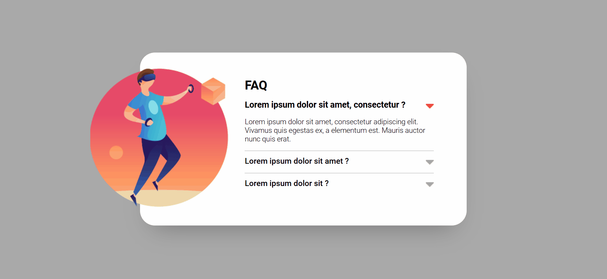

# Projeto FAQ Accordion Teste
Projeto de criação de um FAQ usando accordion para aprimoração de conhecimentos e prática 💻🚀

## Linguagens utilizadas:
- HTML5
- CSS3
- JavaScript

## Objetivo:
Criar um accordion em formato de FAQ para por em prática novos conhecimentos em JavaScript.

## Dificulades enfrentadas:
Na parte do HTML e CSS foi desenvolvido bem mais fácil pois não tinha muitas coisas diferentes do que eu já tinha feito anteriormente.
No JavaScript não foi tão difícil a criação do código mas sim pensar no que o projeto teria que fazer e ai sim construir o código, depois que foi bem pensado, o código fluiu e o resultado saiu como satisfátorio
da minha parte.